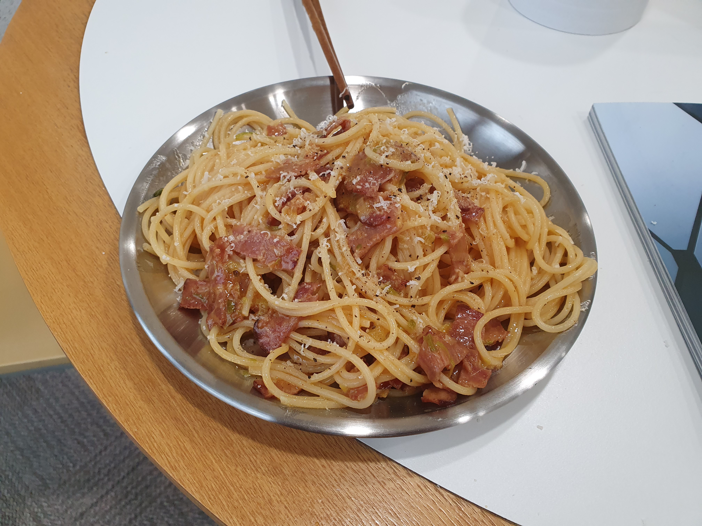

버터 대파 파스타 요리 일지

# 1. 소개

오늘 한 요리는 **버터 대파 까르보나라**다.

예전에 몽골리안 비프 하고 남은 대파가 있어서 한번 해봤다.

참고한 레시피는 가끔 보는 요리보고 조리보고 라는 분의 영상이다.

# 2. 참고자료

{% include video id="4HgGsASHsn4" provider="youtube" width="70%" height="70%" %}

# 3. 일지

## 2021-03-12

### 레시피

- **재료**

  - 노브랜드 베이컨 3줄
  - 대파 1대
  - 그라나 파다노
  - 후추
  - 소금
  - 디벨라 파스타 150g
  - 올리브유
  - 물 1L
  - 소금 10g
  - 파프리카 가루
  - 앵커 버터

- **조리순서**

  1. **베이컨을 중불에 볶기**
    - 디글레이즈를 2번 할 때까지 하면 됨.
    - 파프리카 가루 뿌리기
  
  2. **버터랑 대파 넣기**
    - 소금, 후추로 약간 간하기

  3. **면, 버터, 면수 투하** 
    - 면수는 간을 보고! 이 파스타는 간 맞추기가 약간 어려움

  4. **불을 끄고 만타카레**

  5. **그라나 파다노와 후추 약간 뿌리기**

### 후기

버터의 고소한 맛과 대파의 시원한 맛, 베이컨 및 베이컨 기름의 짠맛 그리고 감칠맛이 어우러져 꽤 맛있었다. 

아쉬웠던 점은 이 파스타가 버터가 완전 메인인 것 같은데 앵커 버터 자체가 가지는 풍미가 부족해서 조금 맛이 떨어졌었다.

나중에 이즈니 버터 사서 해보면 더 맛있지 않을까 싶다.

또 자칫 느끼할 수 있는 버터 코팅 면을 잡아주는 것이 대파인데 대파가 워낙 비싸서 하나만 넣었더니 느끼한 맛을 완전히 눌러주지는 못했다.

다음에 할 때는 대파만큼은 팍팍 넣어야 할 것 같다.

### 레시피 수정

- 대파를 팍팍 넣자

- 파프리카 파우더는 굳이 넣을 필요는 없을 듯

- 매운 맛을 약간 추가해서 느끼한 맛을 눌러도 좋을 듯