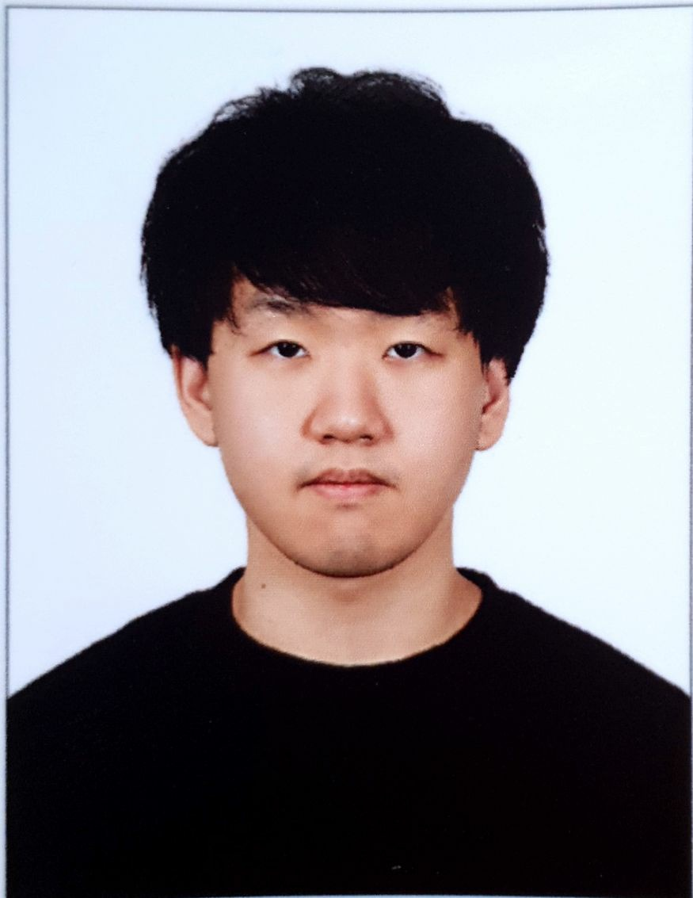

{: width="20%" height="20%"}

**JaeHyun Ha**, Graduate Student

- [Data Systems Lab @ Pohang University of Science and Technology (POSTECH)](https://dslab.postech.ac.kr/)
  
- Advisor: [Wook-Shin Han](https://sites.google.com/a/dblab.postech.ac.kr/postechdblab/home/people/professor-1)

# Contact Information

- Email : [yshajae@postech.ac.kr](mailto:yshajae@postech.ac.kr)

- Address: Dept. of Computer Science and Engineering, POSTECH, Pohang, South Korea

# Areas of Interest

GPU-accelerated database, graph database, cardinality estimation, query optimization

# Education

- B.S. (2018.02 ~ 2022.02) @ POSTECH, South Korea, Dept. of Computer Science and Engineering (Summa Cum Laude, Class of 2021: 1st in Dept. of Computer Science and Engineering) (4.06/4.3)

# Publications

- Kim, K., **Ha, J.**, Fletcher, G., and Han, W., “Guaranteeing the O(AGM/OUT) Runtime for Uniform Sampling and Size Estimation over Joins” (ACM PODS 2023) (**For the first time by Korean**)
- Lee, W. (equal contribution), **Ha, J.** (equal contribution), Han, W., Park, C., Park, M., Han J., and Lee, J., "DoppelGanger++: Towards Fast Dependency Graph Generation for Database Replay" (ACM SIGMOD 2024)
- Lee, W. , **Ha, J.**, Han, W., Park, C., Park, M., Han J., and Lee, J., "DoppelGanger++: Towards Fast Dependency Graph Generation for Database Replay" (PVLDB Demo 2024)

# Selected Projects

- EduCOSMOS (Course Project)
  - Implementing the following sub-projects in the COSMOS storage manager
  - Three sub-projects: a buffer manager, an object management and a B+ tree index manager

- Turbograph-S62
  - Implementing graph DBMS components based on Orca, DuckDB
  - Mainly developed compiler and execution engine

# Industry Experience

- Intern (2020.07 ~ 2020.08) @ SK hynix Inc, Korea
  - Worked on the Digital Platform team: development of a real-time comment overlay technique for SK Hynix 

# Scholarship

- POSTECHIAN Fellowship (2022.05, 2023.11)

# Teaching Experience
