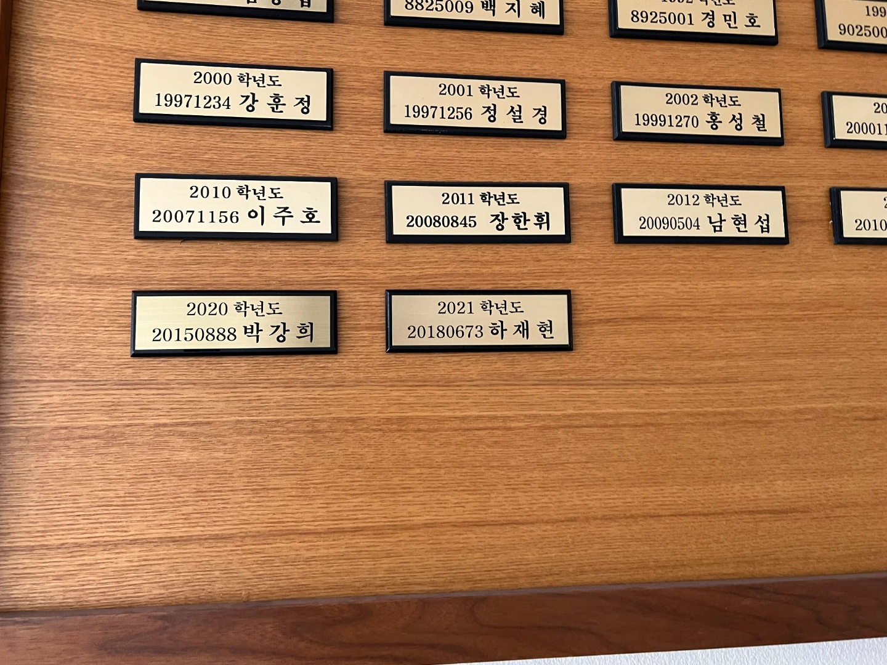
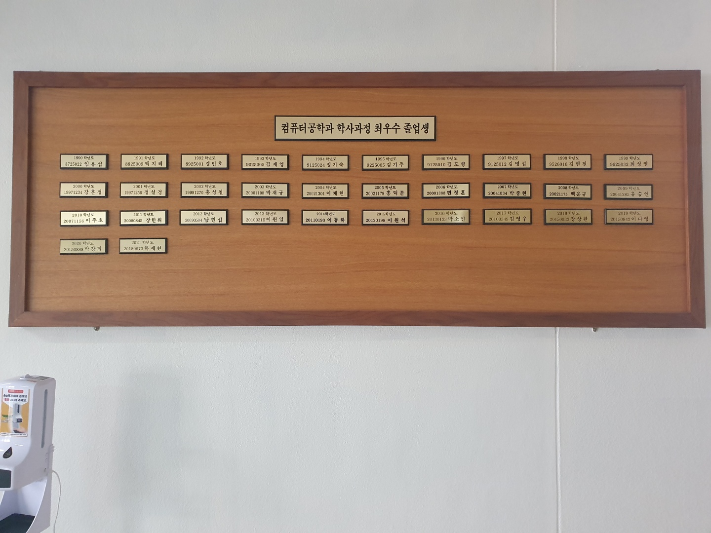

놀랍게도 2021년 컴공과 수석 졸업을 하게 되었다.

개인적으로 내가 수석 정도의 실력은 아니라고 생각하지만 운이 좋았다. 학부생 시기의 끝을 잘 맺은 것 같아 기분이 좋다. 앞으로 남은 대학원생 시기도 잘 마무리 되었으면 좋겠다.

여담이지만 우리 연구실에 **전체 수석 한명과 컴공과 수석(혹은 차석) 한명**이 입학할 것 같다. 두 명 다 내가 오랫동안 봐오던 후배들이었기에 이 친구들의 성향과 목표를 아주 잘 알았고, 그렇기에 우리 연구실이 이 친구들한테 가장 잘 맞을 것이라는 확신이 있었다. 죄다 AI로 가는 시기에 내 말을 믿고 우리 연구실에 진학을 결정해준 후배들에게 정말 감사한 마음이다.

한편으로는 무거운 책임감을 느낀다. 내가 이 학생들을 데려온 만큼 반드시 학생들의 목표를 이뤄줘야만 한다. 다만 그런 책임감이 나를 계속 움직이게 하는 주요한 원인이기도 하니, 부담이 나쁜 것만은 아니기는 하다 ㅎㅎ

이 후배들의 영입이 우리 연구실이 세계 최고의 연구실로 우뚝 서는 계기가 되었으면 하는 바램이다.